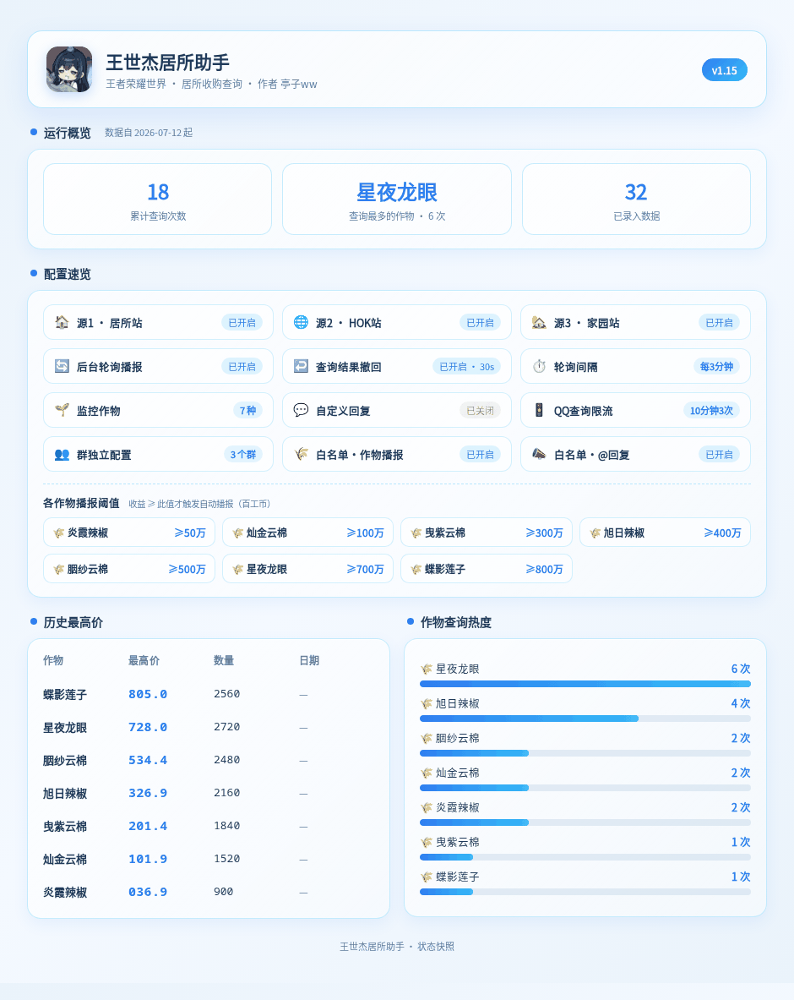

# 王世杰居所助手

王者荣耀世界居所查询助手 - AstrBot 插件，三数据源查询作物收购分享、牧场产品、家具商人等信息。

数据来源：jusuo.playmmo.cn 酸奶很忙 + hokshijie.online 五河道士哟 + wsjjiayuan.cn 黑土豆

## 指令一览

| 指令 | 说明 |
|------|------|
| `高倍 <作物名>` | 查询作物高价收购（严格匹配，多源合并） |
| `<作物名>` | 直接发作物名也可查询 |
| `搜索 <商人名>` | 按商人名查询分享（收购分享 + 家具图鉴 + 家具分享） |
| `商人` | 查看已知商人列表 |
| `牧场 <产品名>` | 查询牧场产品分享（无参数列出可查产品） |
| `家具 <家具名>` | 查询家具分享（无参数生成家具图鉴图片） |
| `交友墙` | 查看最新 5 条搭子交友墙 |
| `模板` | 查看热门建造模板 TOP 5 |
| `居所` | 查看插件全部指令总览（作用 / 用法 / 权限） |
| `刷二` | 手动扫描 1.8 倍+ 高价作物 |
| `播报开关` | 开关自动 1.8 倍+ 轮询播报（默认关闭） |
| `检测开关` | 开关白名单群消息检测（全部三项） |
| `自定义回复 <内容>` | [管理员] 设置/清空白名单群自动回复 |
| `设置 <作物> 阈值 <数字>` | [管理员] 设置单个作物的播报阈值 |
| `设置撤回 <秒数>` | [管理员] 设置查询结果自动撤回秒数（0=关闭） |
| `帮助` | 查看帮助（管理员可见额外指令） |
| `状态` | 查看当前群配置及播报阈值 |
| `查询统计 [<作物名>]` | 查看作物被查询次数统计（计数器）；无参显示全榜降序+累计，带作物名查该作物次数 |
| `清除最高价 [<作物名> \| 全部]` | [管理员] 清除指定作物或全部的历史最高价记录（用于清理捣乱数据） |

> 查询类指令返回的详细数据自动撤回（QQ 群，默认 30 秒，可通过 `设置撤回 <秒数>` 或 WebUI 修改）；管理员不受 QQ 级限流限制。

### 查询统计指令

`查询统计` 查看各作物被查询次数的累计计数器（自 2026-07-12 起开始累计，不补旧数据）。

- `查询统计`：显示全榜降序（每种作物被查次数 + 累计总数），并高亮「查询最多的作物」
- `查询统计 <作物名>`：单独显示该作物被查询的次数

每次作物查询自动 +1，数据持久化在 `data/plugin_data/jusuo/_crop_query_counts.json`，插件重载或更新不丢失。

### 状态指令

`状态` 查看当前群的配置与运行状态，以**数据看板图片**的形式返回（QQ 群默认发送 PNG 图片，非 QQ 平台降级为文字汇总）。

**数据看板包含以下区块：**

| 区块 | 说明 |
|------|------|
| 运行概览 | 三张统计卡：累计查询次数 · 查询最多的作物及查询次数 · 已录入数据条数 |
| 配置速览 | 12 项运行参数卡片：数据源 1/2/3 开关 · 后台轮询播报状态 · 查询结果撤回时间 · 轮询间隔 · 监控作物数量 · 自定义回复 · QQ 查询限流 · 群独立配置数 · 白名单播报/回复开关 |
| 播报阈值 | 七种作物各自的播报阈值（≥N 万） |
| 历史最高价 | 四列表格（作物 · 最高价 · 数量 · 日期），价格 000.0 格式，日期 MM-DD |
| 作物查询热度 | 条形图展示各作物被查询频次（日 / 周 / 总 三标签切换） |

**使用方式：**
- `状态` —— 发送当前群的完整数据看板图片



### 清除最高价指令

`清除最高价` 用于清理被人为捣乱写入的历史最高价记录，仅**管理员**可用。

**使用方式：**

- `清除最高价 蝶影莲子` —— 清除指定作物的历史最高价记录（精确匹配作物名）
- `清除最高价 全部` —— 一键清空全部历史最高价记录（输入 `全部` / `所有` / `all` 才触发，防误触）

**说明：**

- 作物名支持带后缀写法，如 `清除最高价 蝶影莲子的最高价` 等同精确写法
- 若输入片段模糊匹配到多个作物（如 `辣椒` 同时命中「旭日辣椒」「炎霞辣椒」），指令不会误删，而是列出候选让你写全名
- 清除后立即落盘生效，仪表盘的「历史最高价」与 `状态` 出图实时更新
- 被清掉的作物，后续轮询到更高价时会自动重新记录，不会永久丢失

### 居所指令

`居所` 返回插件**全部使用指令的总览**，每条含「作用 + 用法示例 + 权限标注」，是新手快速上手的总入口。

**权限标注规则：**

- `[全员]`：所有群成员均可使用
- `[管理员]`：仅 AstrBot 配置的群管理员可使用

**清单按三类分组：**

- **一、查询指令（全员）**：`高倍 <作物>`、`[作物名]` 直接查询、`搜索 <商人>`、`商人`、`牧场 <产品>`、`家具 <家具>`、`交友墙`、`模板`
- **二、工具与状态（全员）**：`刷二`、`播报开关`、`检测开关`、`查询统计 [<作物>]`、`状态`、`帮助`、`居所`
- **三、管理员指令（管理员）**：`自定义回复 <内容>`、`设置 <作物> 阈值 <数字>`、`设置撤回 <秒数>`、`清除最高价 [<作物> | 全部]`

> 提示：`帮助` 指令为简版入口，管理员会额外看到管理员指令行；`居所` 则一次性列出全部指令并标明权限。

## 播报阈值配置

轮询播报按作物独立设置阈值，仅当收购价格 ≥ 阈值时才推送播报。

### 管理员指令

```
设置 <作物名> 阈值 <数值>
设置 <作物名> 播报阈值 <数值>
```

支持简写，如 `设置 辣椒 5000000`（500 万百工币）。数值支持带"万"后缀：`设置 辣椒 500万`。

```
设置撤回 <秒数>
```

设置查询结果自动撤回时间，`0` 关闭撤回。默认 30 秒，仅 QQ 群生效。

### 默认阈值

| 作物 | 默认阈值 | 作物 | 默认阈值 |
|------|---------|------|---------|
| 炎霞辣椒 | 999 万 | 胭纱云棉 | 999 万 |
| 灿金云棉 | 999 万 | 星夜龙眼 | 650 万 |
| 曳紫云棉 | 999 万 | 蝶影莲子 | 800 万 |
| 旭日辣椒 | 480 万 | | |

## 输出格式（作物查询）

```
🌾 炎霞辣椒 · 收购分享
共17条 | 按倍率↓ | 多源合并

 1. ✨x2.0  ×100    Lv.11   11.2万百工币  UID 1986317
 2. ✨x1.7  ×80     Lv.23✓  9.5万百工币  UID 1011857301
 3. ✨x1.7  ×60     Lv.1    3.1万百工币  UID 2029686635
```

每行显示：排名、倍率、数量、菜摊等级（✓表示百家满级）、预计价格、UID。多源数据合并，按倍率降序排列，自动去重。价格以万为单位。

### 预计售价计算公式

```
菜摊系数 = 1.0 + (菜摊等级 - 1) × 0.05
百家加成 = 1.20（百家满级）/ 1.0（未满）
预计售价 = 单价 × 数量 × 倍率 × 菜摊系数 × 百家加成
```

- **菜摊等级**：每级提升 5% 加成
- **百家满级**：额外 +20% 加成
- **收购上限过滤**：已达商人收购上限的分享自动隐藏（源1: `is_limit_reached`，源2: `capped`，源3: `markUsers`/`sold_out`）
- **严格匹配**：`高倍` 指令会校验作物名，输入不存在的作物会返回可用作物列表
- **多源去重**：三个数据源结果按 UID 去重，按倍率降序排列

## 家具图鉴（Playwright 渲染）

发送 `家具`（无参数）时，使用 Playwright 渲染精美的 HTML→PNG 家具图鉴图片：
- 按商人卡片式展示全部家具，带品质徽章（紫/蓝/绿）
- 卡片左侧彩色竖线区分不同商人
- 自动从 CDN 加载中文字体，渲染清晰美观
- Playwright 未安装时自动回退为文字列表

## 限流与撤回

| 规则 | 说明 |
|------|------|
| QQ 级限流 | 每 QQ 10 分钟最多查询 3 次 |
| 管理员豁免 | 管理员不受限流限制 |
| 自动撤回 | 查询结果 30 秒后自动撤回（仅 QQ 群 adapter 路径生效） |

## 白名单群自动回复

在 WebUI 的「群聊配置1~5」（可折叠 object）中录入群号后，每个群可独立开关全部功能，未填写的功能项继承「回复与权限」分组中的全局默认值。

群内支持以下自动操作：
- 直接发**作物名** → 自动查询高倍收购
- 直接发**商人名** → 自动查询（收购分享 + 家具图鉴 + 家具分享）
- 直接发**牧场产品名** → 自动查询牧场分享
- 直接发**家具名** → 自动查询家具分享
- @机器人 或 发送"**商人**" → 自动回复使用指南（可每群独立自定义内容）

### 每群可独立配置的功能

| 配置项 | 类型 | 说明 |
|--------|------|------|
| 群号 | string | 填入群号启用该群，留空不启用 |
| 作物名自动查询 | bool | 检测作物名自动查询高倍信息 |
| @机器人自动回复 | bool | @机器人回复使用指南/自定义内容 |
| 商人关键词自动回复 | bool | "商人"关键词自动回复 |
| 自定义回复内容 | string | 独立自定义回复文本（留空用全局） |
| 接收高价播报 | bool | 是否接收轮询播报推送 |
| 启用数据源1 | bool | 该群是否使用居所站数据源 |
| 启用数据源2 | bool | 该群是否使用 HOK 站数据源 |
| 启用数据源3 | bool | 该群是否使用家园站数据源 |
| 监控作物（多选） | list | 七种作物 WebUI 多选，默认全选 |

> 最多支持 5 个白名单群，每个群在 WebUI 拥有独立的可折叠 object 配置块（群聊配置1~5），默认折叠，展开即可配置。

## 安装

将 `astrbot_plugin_jusuo` 文件夹放入 AstrBot 的 `data/plugins/` 目录，在 WebUI 重载插件即可。

> **依赖**：家具图鉴功能依赖 Playwright。需手动安装：`pip install playwright && playwright install chromium`

## WebUI 配置

插件已内置三个数据源的 API 地址，开箱即用。可在 WebUI 插件配置页进行以下设置：

| 分组 | 配置项 | 说明 |
|------|--------|------|
| 数据源 | 地址/密钥 | 三数据源 API 地址和密钥 |
| 数据源 | 开关 | 单独启用/禁用数据源1/2/3 |
| 轮询播报 | 播报开关 | 默认关闭，开启后每 3 分钟多源扫描 |
| 轮询播报 | 播报阈值 | 每种作物独立阈值，如上节所述 |
| 回复与权限 | 作物/提及/商人 | 全局默认开关 |
| 回复与权限 | 自定义回复 | 全局默认自定义回复文本 |
| 回复与权限 | 管理员QQ | 逗号分隔，可使用设置/自定义回复指令 |
| 群配置1~5 | 折叠分组 | 每群含群号+全部功能开关+监控作物多选 |

## 插件页面（Dashboard）

插件内置独立可视化页面，可在 AstrBot Dashboard → 插件 → 王世杰居所助手 → 页面 中打开（浅色液态玻璃主题，自适应移动端）。

页面包含以下区块：

- **运行概览**：累计查询次数、查询最多的作物
- **配置速览**：数据源 1/2/3 开关、轮询播报状态、撤回秒数（自适应网格卡片，移动端自动单列）
- **数据看板**：左右双栏，两个模块等高对齐
  - 作物查询热度（日 / 周 / 总 三标签切换）
  - 历史最高价（作物 / 最高价 / 数量 / 日期 四列首字左对齐，价格 000.0 格式，日期 MM-DD 短格式）

页面数据由 3 个页面 Web API 驱动（overview / crop-heat / high-records），前端每 3 秒轮询刷新；历史最高价数据持久化在 `data/plugin_data/jusuo/_high_records.json`，重启不丢失。

## 支持查询的作物

炎霞辣椒、灿金云棉、曳紫云棉、旭日辣椒、胭纱云棉、星夜龙眼、蝶影莲子

## 商人

芍药、紫翠、虎头、金靡、鱼丞相

## 牧场产品 & 家具

牧场产品和家具均为动态从多源 API 获取，无参数发送 `牧场` 或 `家具` 可查看全部可查列表。

---

## 更新日志

### v1.00 · 2026-06-04
- 初始版本：双数据源查询（作物收购/牧场/家具/交友墙/模板）

### v1.01 · 2026-06-05
- 价格计算公式（菜摊系数+百家加成）、严格作物匹配、商人搜索、README 完善

### v1.02 · 2026-06-06
- 修复 None 值转换异常、收购上限过滤、HOK API 作物名手动过滤、多源去重

### v1.03 · 2026-06-07
- 修复直接发作物名路由失效、新增「居所」指令、修复牧场查询
- 新增 2 倍自动轮询播报、播报阈值
- 白名单群控制、管理员自定义回复、白名单检测拆为 3 开关
- 牧场产品直发查询、轮询间隔 3 分钟

### v1.04 · 2026-06-08
- 商人独立命令处理器、家具查询优化（无参数列全部家具名 / 白名单直接查询）
- 指令介绍重排版美化、轮询播报默认关闭
- 修复家具名列表（furniture_ids 代替 merchant_name）、UUID 过滤

### v1.05 · 2026-06-13
- 消息格式最终方案：绕过 respond stage 用 text segment 数组直发
- 全局换行修复（WebUI 开关 + handler 生成器包装、initialize 兼容、`_fixed_plain_result` 迁移、帮助/居所/状态统一路径）
- 修复白名单双重触发和双次发送
- 帮助指令框线分隔、百工币价格排序对齐

### v1.06 · 2026-06-14
- 家具图鉴 Playwright HTML→PNG 渲染（卡片布局 + 品质徽章）
- 查询结果附加 12 小时制北京时间；拦截 Agent 自触发消息
- 修复 emoji tofu 方框、图鉴排版优化
- 精简帮助/居所/自动回复模板；广播 adapter 缓存优化
- 商人名查询重做：收购分享 + 家具图鉴 + 家具分享三合一返回

### v1.07 · 2026-06-20
- 网站一(public-query)新增 API 密钥验证 (x-api-key)，可在 WebUI 配置页修改

### v1.08 · 2026-06-29
- 轮询播报配置拆分为独立 WebUI 分组（不与回复/权限合并）；补充缺失的 poll_threshold 配置项
- 星夜龙眼默认阈值 650w、蝶影莲子 800w；查询结果默认显示 10 条

### v1.09 · 2026-07-02
- 白名单群独立配置（每群 7 项功能 + 监控作物 + 阈值，未填写继承全局）；QQ 级限流（10 分钟 3 次，管理员豁免）；查询量改为 5 条
- WebUI 可视化分组进化为折叠化重构（5 个可折叠 object 嵌套块、7 个作物多选 list、旧配置自动兼容迁移）
- 群配置新增数据源 1/2/3 开关支持 per-group 控制
- 新增数据源 3「家园站」(wsjjiayuan.cn)，作物/轮询/牧场/家具三源合并，标记和售罄自动剔除
- 状态指令 UI 重构（emoji 对齐、中文命名、启用列表区块）；「双源」→「多源」文案统一；状态指令只显示当前群配置
- 查询结果 30s 自动撤回

### v1.10 · 2026-07-06
- 撤回时间可配置；所有查询结果标题行显示撤回时间
- 设置阈值指令回写 AstrBot 配置，WebUI 同步显示
- 播报状态持久化到文件，插件重载不再重复播报
- 兼容微信等非数字群 ID 平台（adapter 直发仅对 QQ 群生效）

### v1.11 · 2026-07-10
- 新增「查询统计」指令（作物被查询次数计数器，全榜降序+累计 / 单作物次数）
- 新增插件独立页面 Dashboard（pages/dashboard，浅色液态玻璃主题，含运行概览/作物热度/历史最高/实时查询/配置速览）
- 桥接 4 个页面 Web API：overview / crop-heat / high-records / query
- 修复 Dashboard 异步注入 bridge 的竞态导致「页面桥接未就绪」

### v1.12 · 2026-07-12
- 插件页面（Dashboard）多项优化：
  - 移除「实时查询」模块（页面 Web API 由 4 个减为 3 个：overview / crop-heat / high-records）
  - 运行概览精简为「累计查询次数」+「查询最多的作物」两卡
  - 配置速览重做为自适应网格卡片（图标+名称+状态点，移动端单列）
  - 标题区优化（版本号徽章紧贴标题同一行）
  - 数据看板双模块（作物查询热度 / 历史最高价）等高对齐，历史最高价表格四列首字左对齐、价格 000.0 格式、日期 MM-DD 短格式

### v1.13 · 2026-07-21
- 新增动物提醒指令（经验动物/金币动物/提醒查询/动物提醒/取消动物提醒等）在白名单群内**无需 @ 即可触发**
- 动物催产提醒改为**一次性**：提醒一次后自动从订阅列表移除，不再自动循环；需用户再次发送指令才重新订阅。
- 修复白名单群自动检测失效：指令事件为 None 时，回退取裸 id（去除 `OneBotV11_group_` 等前缀），使自动登记与监听判断对齐。
- 三处异常日志补充类型名：source1 REST 请求失败 / asyncio.gather 查询异常 / 牧场预设加载失败，便于定位网络或超时问题。


> 当前版本：**v1.13** · 更新时间：2026-07-21
